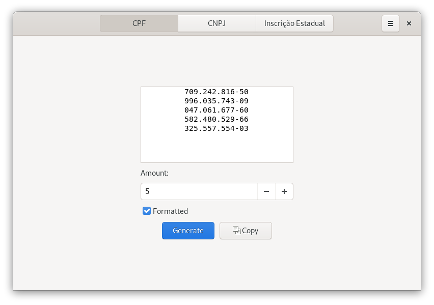
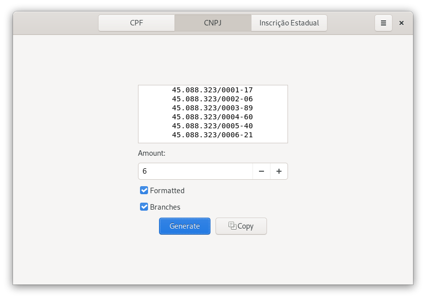
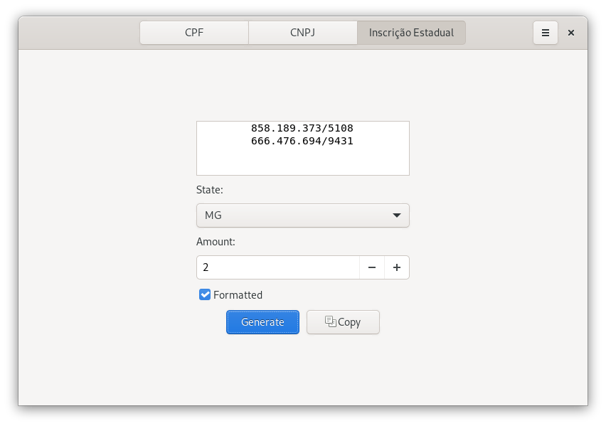

# Identifications
It is a tool for the QA team and developers who needed identifications used in Brazil as CPF, CNPJ and IE to test.

# Screenshots

# Features
* Generate CPF with or without format
* Generate CPNJ with branchs and with or without format
* Generate IE with or without format
* Copy all idenfications generated to clipboard

# Instalation

# Building from source

  Option 1: with GNOME Builder
  * Open GNOME Builder
  * Click the Clone Repository button
  * Enter git@github.com:edenalencar/identifications.git in the field Repository URL
  * Click the Clone Project button
  * Click the Run button to start building application
  
  Option 2: with Meson
  You'll need the following dependencies:
  * gio-2.0
  * gtk+-3.0
  * gee-0.8
  * gettext
  * glib2
  * gtk3
  * meson
  * vala
  * ninja
  * git
  
  Clone the repository and change to the project directory
  
    git clone git@github.com:edenalencar/identifications.git
    cd identifications
    
  Run meson build to configure the build environment. Change to the build directory and run ninja to build
    
    meson build --prefix=/usr
    cd build
    meson compile

 # Donations
  If you would like to help me in this and future projects, please choose one of the options below to donate!
 
#### Option 1: Liberapay
   <noscript></noscript>

#### Option 2: Paypal
  

 
